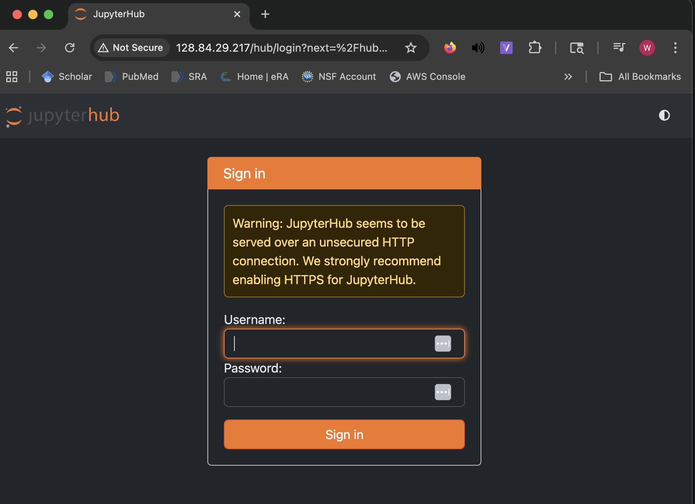
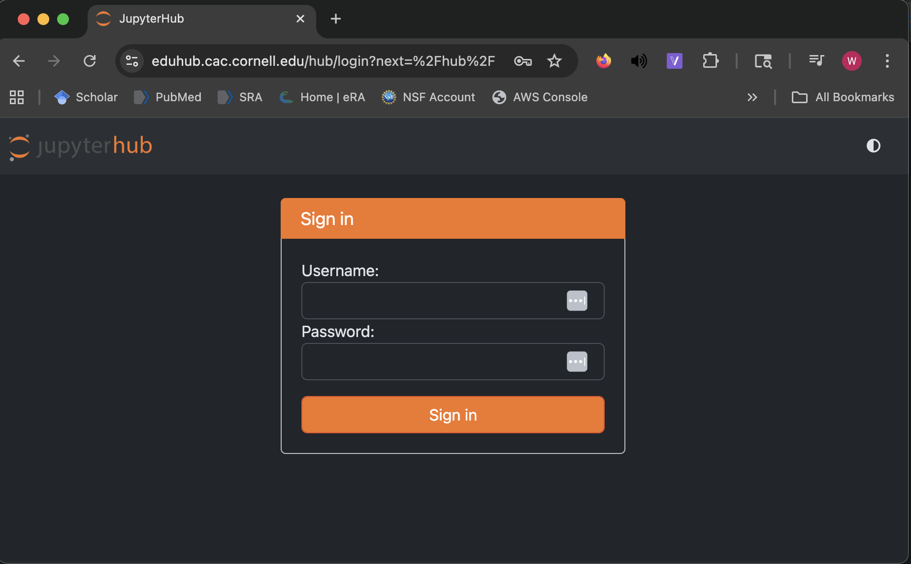
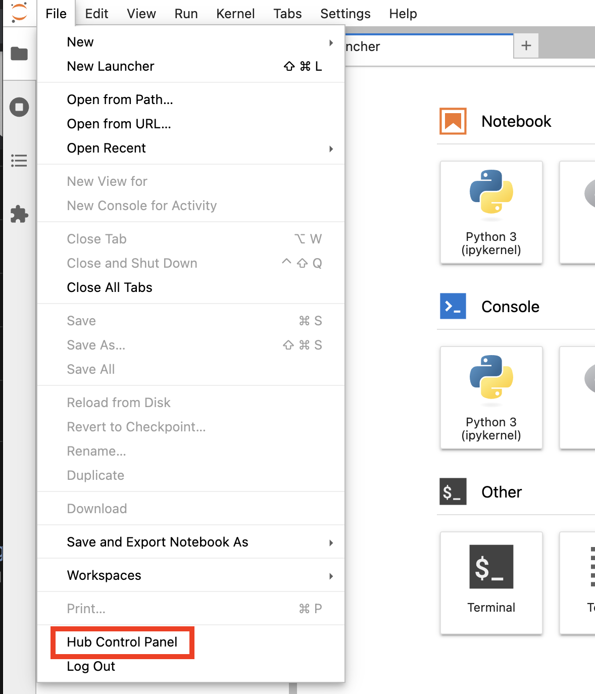
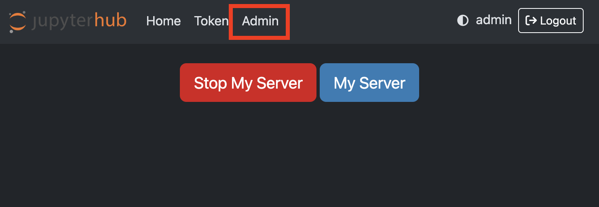
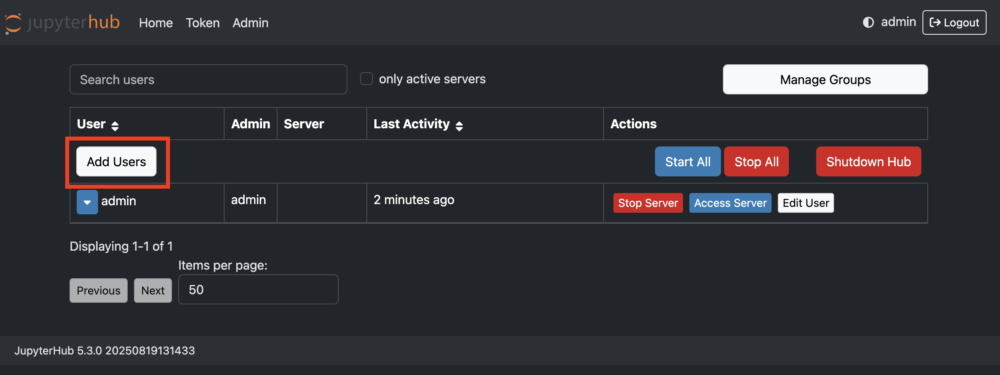
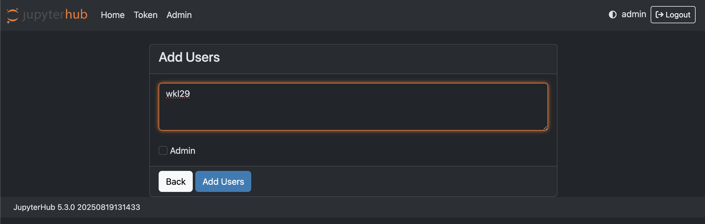
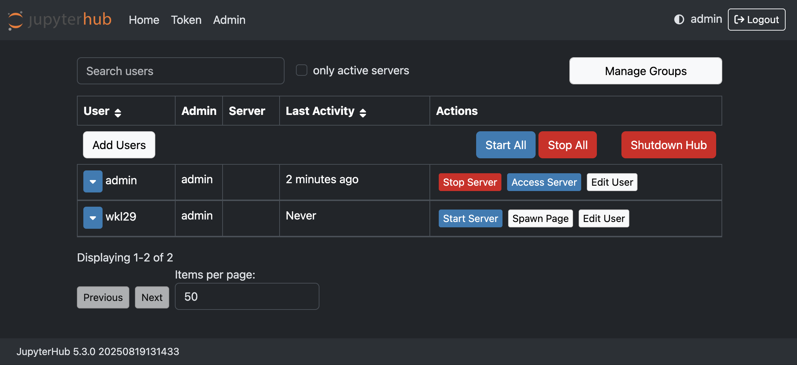
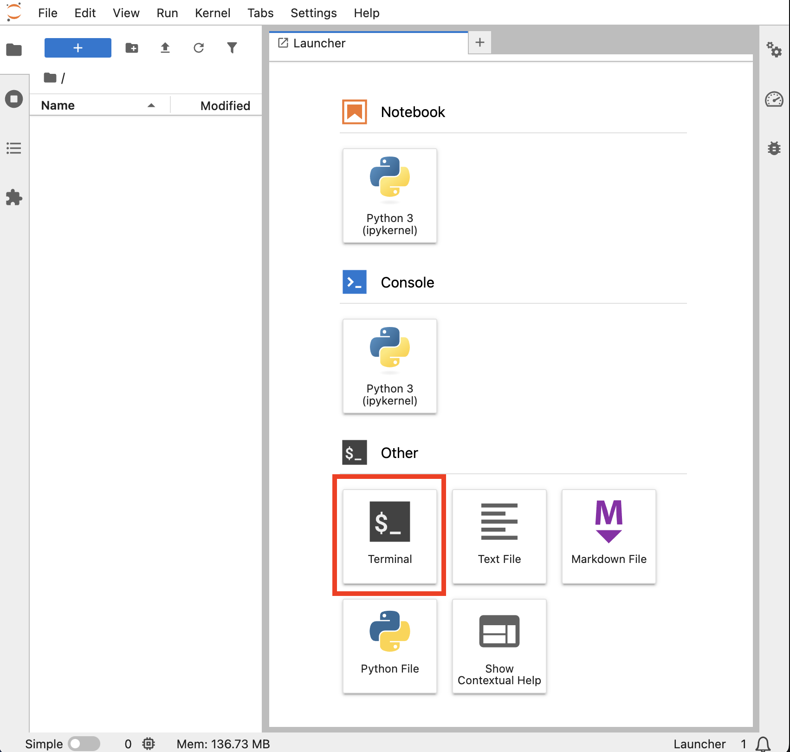
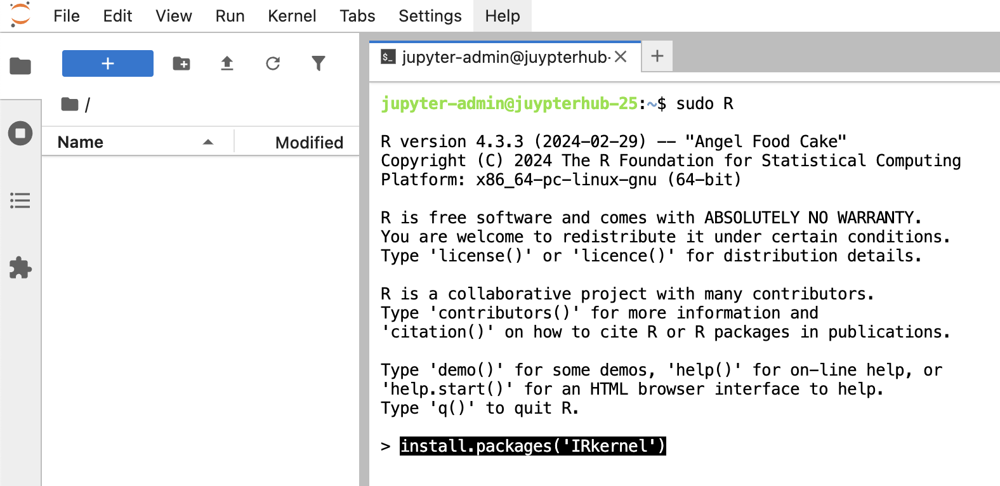
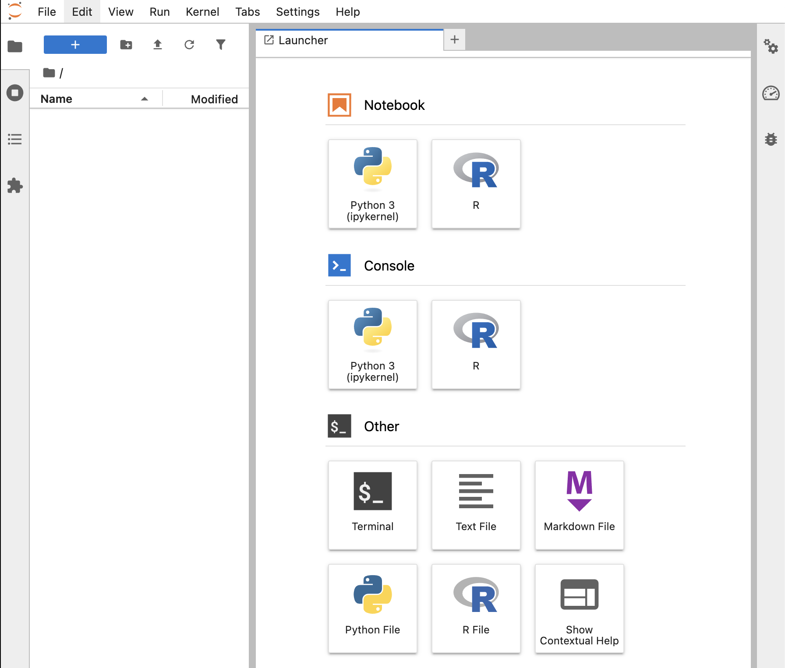

# Deployment

These commands and scripts are validated for Ubuntu 24.04 and have been tested on JetStream2 (Regional-Cornell), but are expected to work on any Ubuntu24 system with root and a registered hostname.

**Note: CILogon integration requires a registered hostname**

 - Before initiating the CILogon step, make sure your site is registered here: https://cilogon.org/oauth2/register
 - Make sure your netID is registered as an admin user in the JupyterHub before you add CILogon authentication so that you can login after you turn it on!

## Deploying JupyterHub (aka 'what to check at each stage')
This section is written to correspond with each of the distinct 01-06 steps in the deployment process. While the 01-03 deployment scripts be run sequentially from the command line inside the server, for debugging reasons, it is recommended to manually copy and paste the commands and confirm the changes to the system at regular checkpoints which are detailed below.

01. This provides a local sudo account and ssh password authentication. You can check that this step worked by logging in through Terminal/PuTTY. This step is optional as you can operate through the default Ubuntu account, but can be useful if multiple users have access to this account.

02. JupyterHub should now be deployed on your system although it should be hosted through the IP address and is not SSL-secured.

Navigate to: ``http://<public-ip>``

  

You can now login with the newly created **admin** account. The password is set upon initial login. **ANY** password you enter will set the admin password and initiate login. This can be changed later, but it is recommended to make it secure.

You should see something like this:

  

3. This step configures the JupyterHub user-defaults and also enable HTTPS through LetsEncrypt.

TLJH defaults are explained in-depth here with plenty of examples:
- https://tljh.jupyter.org/en/latest/topic/tljh-config.html

The defaults we provide are geared towards Cornell's CB2010/6020 Introduction to Computational Biology for 100 students.

HTTPS through LetsEncrypt **requires** a registered hostname, both of which (HTTPS and hostname) are required for CILogon authentication. You can run the rest of the deployment scripts without HTTPS and CILogon authentication, but your mileage may vary.

After this step, you should see something like this:

  

4. Before configuring CILogon, you **MUST** be registered through the CILogon portal hosted by NCSA. This is free but can take >24hrs for registration to take effect. You must also make sure that the netID you want to manage the JupyterHub is added to the authorized user list before you switch over to CILogon authentication.

Navigate to Hub Control:

  

Click the Admin tab:

  

You can add new users through this interface. Click the 'Add Users' button:

  

Users can be added 1 line at a time. For CILogon/Cornell shibboleth integration, the netIDs should be added without the '@cornell.edu'. Click the checkbox if the added users are to be added as admins.

  

After adding users, confirm that your users are listed as 'admin' and that your console now looks something like this:

  

CILogon configuration details can be added through the ``tljh-config``, however these instructions result in embedding the configuration parameters within the server. Follow ``04_configure_CILogon.txt`` and include the secret keys provided by CILogon.

After adding the cilogon.py file as directed, run ``sudo reboot`` and you should now see:

  

5. To install R-compatibility within the JupyterHub, you must login to the JupyterHub and run the provided commands within the Terminal-emulator inside the Hub as an **admin**

Activate terminal here:

  

Run commands using ``sudo R``:

  

R should now appear as an option for Notebooks and Console:

  

6. Similar to installing R as sudo within the JupyterHub terminal (see Step 5), the commands within 06_install_dependency.txt are meant to be run within the JupyterHub terminal. This is because the python environment within the JupyterHub is sandboxed from the Ubuntu server. Installing packaged on the server will NOT result in that code being available to users in the JupyterHub and may break the entire system if competing dependencies are enabled.
